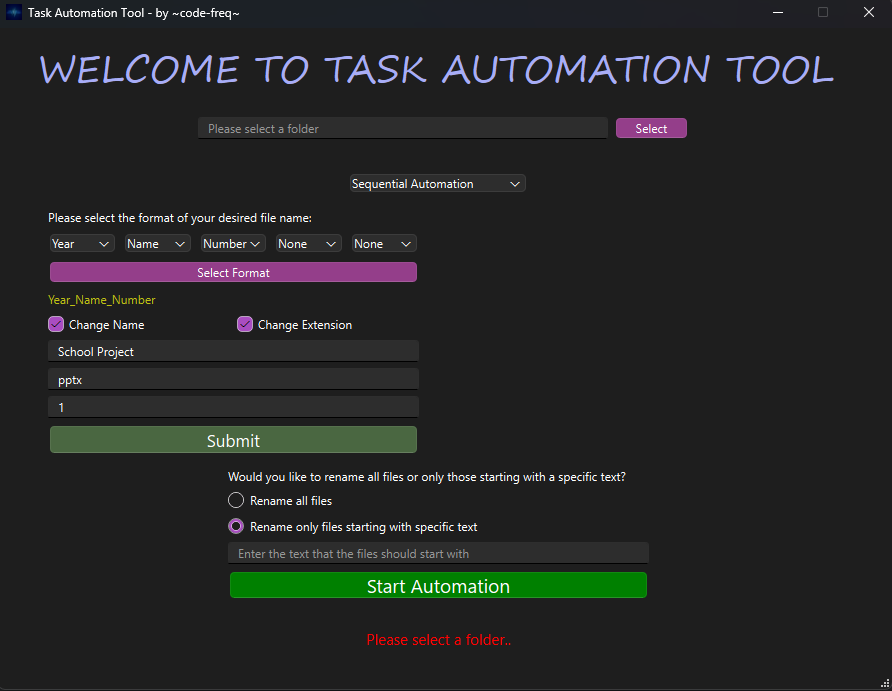
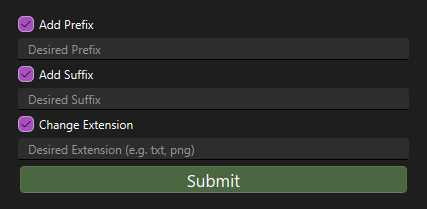
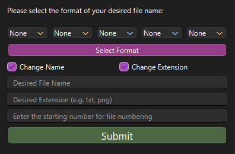
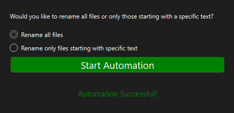

# Task Automation Tool

## Overview
The **Task Automation Tool** is a Python-based utility with a PyQt6 Designer interface, designed to simplify the process of renaming multiple files in a folder according to customizable formats. This tool supports sequential numbering, date-time stamping, custom file names, and extension changes, making it ideal for organizing large sets of files.

## Features
- **Sequential File Renaming:** Rename files with sequential numbers and optional custom names, dates, and times.
- **Combination Renaming:** Add prefixes, suffixes, or modify the extension without changing the original file names.
- **Date and Time Stamping:** Automatically append file creation date, time, or just the year to file names.
- **Custom Filters:** Option to rename all files in a folder or only files that start with a specific text.
- **Extension Management:** Option to change file extensions or keep the original ones.

## Installation

1. Clone the repository:
    ```bash
   git clone https://github.com/code-freq/task-automation-tool.git
   ```
2. Install the required dependencies:
    ```bash
   pip install pyqt6
   ```

## Usage
1. Open a terminal and navigate to the directory containing the `automation.py` script:
    ```bash
    cd path/to/your/directory
    ```
2. Run the `automation.py` script:
    ```bash
    python automation.py
    ```
3. Follow the prompts to select a folder and configure renaming options.

### Modes
- **Sequential Mode:**

    Define a format for file names using the following keywords:
    - `name`: Custom name for files.
    - `number`: Sequential numbering.
    - `date`: File creation date.
    - `time`: File creation time.
    - `year`: File creation year.

  Example formats:
  - `name,number`: Results in `CustomName_1.ext`
  - `date,name,number`: Results in `10-11-2024_CustomName_1.ext`
  - `name,number,date,time`: Results in `CustomName_1_10-11-2024_14-35-10.ext`


- **Combinational Mode:**

    Provide a custom prefix, suffix, and extension to rename files, without altering the original name.
    
    Example:
    - Prefix: `Project`
    - Suffix: `Final`
    - Extension: `txt`
  
    Results in: `Project_OriginalName_Final.txt`

### File Filters
- **Rename All Files:**
    
    Rename all files in the selected folder.


- **Rename Files Starting with Specific Text:**

  Rename only files that begin with specified text.

## Example Screenshots


 






> [!Note]
> 
> The tool was developed with a PyQt6 Designer interface, allowing for a more user-friendly experience.

## Contributing
Feel free to fork the repository and submit pull requests with improvements or bug fixes.

## Contact
For suggestions, recommendations, development ideas, or any issues, feel free to reach out at *code.freq7@gmail.com*